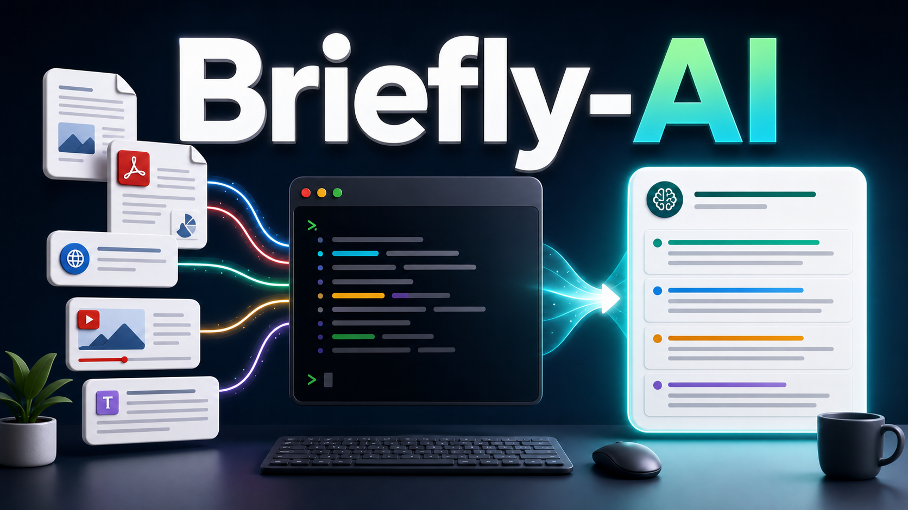

# Briefly AI

Python CLI for creating concise briefs from text, files, URLs, PDFs (including
scanned), local audio/video, local images, and YouTube videos.



Diagrams are kept in `assets/diagrams/` as Mermaid source and SVG renders.

## Supported Inputs

- Plain text
- Local text/Markdown files
- Local and remote PDFs (scanned local PDFs fall back to a vision LLM)
- Local audio/video via Groq Whisper
- Local images (`.png`, `.jpg`, `.jpeg`, `.webp`, `.gif`) via vision LLM
- Web pages
- YouTube videos with captions
- YouTube videos without captions via Groq Whisper fallback
- Stdin

## Quickstart

### Install from PyPI

Recommended for CLI users:

```powershell
uv tool install briefly-ai
briefly --help
```

Run once without installing permanently:

```powershell
uvx --from briefly-ai briefly --help
```

Alternative with pip:

```powershell
pip install briefly-ai
briefly --help
```

### 1. Clone the repo

Use this path if you want to work from source.

```powershell
git clone https://github.com/Rahat-Kabir/briefly-ai
cd briefly-ai
```

### 2. Install dependencies

```powershell
uv sync
```

On Windows, if uv cache or hardlink warnings appear, use the project-local cache
and copy mode:

```powershell
$env:UV_CACHE_DIR='.uv-cache'
$env:UV_LINK_MODE='copy'
uv sync
```

### 3. Set your API key

For OpenAI models, set `OPENAI_API_KEY`:

```powershell
$env:OPENAI_API_KEY='your_openai_api_key'
```

This sets the key for the current PowerShell session. To save it permanently for
your Windows user:

```powershell
[Environment]::SetEnvironmentVariable('OPENAI_API_KEY', 'your_openai_api_key', 'User')
```

Open a new terminal after setting it permanently.

Other providers use their own environment variables, such as
`ANTHROPIC_API_KEY`, `GEMINI_API_KEY`, or other provider keys supported by
LiteLLM.

Common provider keys:

```powershell
$env:OPENAI_API_KEY='your_openai_api_key'
$env:ANTHROPIC_API_KEY='your_anthropic_api_key'
$env:GEMINI_API_KEY='your_gemini_api_key'
$env:GROQ_API_KEY='your_groq_api_key'
$env:OPENROUTER_API_KEY='your_openrouter_api_key'
```

Example model ids:

```powershell
uv run briefly "Hello" --model openai/gpt-4o-mini
uv run briefly "Hello" --model anthropic/claude-sonnet-4-5
uv run briefly "Hello" --model groq/llama-3.1-8b-instant
uv run briefly "Hello" --model openrouter/openai/gpt-4o-mini
```

### 4. Set a default model

```powershell
uv run briefly config init --model <model-id>
```

Example:

```powershell
uv run briefly config init --model openai/gpt-4o-mini
```

The example above uses an OpenAI model, so it requires `OPENAI_API_KEY`.

### 5. Run your first brief

```powershell
uv run briefly "Briefly turns long content into concise briefs."
```

Or pass a model for one command:

```powershell
uv run briefly "Briefly turns long content into concise briefs." --model openai/gpt-4o-mini
```

## Usage

Briefly needs an LLM model for briefing. You can either save a default model
once, or pass `--model` on each command.

### Set a default model

```powershell
uv run briefly config init --model <model-id>
```

This writes `~/.briefly/config.json`. After that, regular commands can omit
`--model`:

```powershell
uv run briefly "Paste or type any text here."
uv run briefly notes.txt
uv run briefly https://example.com
```

To use a different model for one command:

```powershell
uv run briefly notes.txt --model <model-id>
```

One valid model id is `openai/gpt-4o-mini`; use any LiteLLM-supported model id
that matches your API keys.

You can also define named model presets in `~/.briefly/config.json`:

```json
{
  "model": "provider/model-id",
  "models": {
    "fast": "provider/model-id"
  }
}
```

Then run:

```powershell
uv run briefly notes.txt --model fast
```

`config init` refuses to overwrite an existing config unless `--force` is
passed.

### Common examples

```powershell
uv run briefly "Paste or type any text here."
uv run briefly "Long article text..." --length short
uv run briefly "Long article text..." --length long
uv run briefly "Meeting notes..." --brief-type action
uv run briefly https://example.com
```

Current state: early CLI foundation. Briefly can resolve text/file/stdin input,
print extracted text, and generate length-controlled text briefs through
LiteLLM. Brief types shape the prompt for standard, executive, action, study,
and decision-focused output. Config-backed model selection,
trafilatura-backed HTML URL briefing, YouTube caption briefing, Groq Whisper
fallback, local media transcription, token streaming, structured JSON output,
and local cache are available. YouTube transcript timestamps are available in
extract and briefing input.

### Brief a file

```powershell
uv run briefly notes.txt
uv run briefly paper.pdf
uv run briefly paper.pdf --extract
uv run briefly https://example.com/paper.pdf --extract
```

Local and remote PDF input uses pdfplumber; the title comes from PDF metadata
when present, otherwise the filename or URL. Local PDFs with no extractable
text layer (under 50 non-whitespace chars, e.g. scans) fall back to the
configured vision model (`vision.model` / `--vision-model`); set one or you
will get a clear error. Remote/URL PDFs do not yet have this fallback.

### Brief local audio or video

```powershell
$env:GROQ_API_KEY='your_groq_api_key'
uv run briefly meeting.mp3 --extract
uv run briefly meeting.mp3
uv run briefly lecture.mp4 --extract
```

Local media input sends supported files directly to Groq Whisper, caches the
transcript, and uses that text for extract or briefing mode. Supported first
slice: `.mp3`, `.m4a`, `.wav`, `.ogg`, `.flac`, `.mpeg`, `.mpga`, `.mp4`, and
`.webm`. Files over the direct upload limit fail clearly until chunking exists.

### Brief a local image

```powershell
$env:GEMINI_API_KEY='your_gemini_api_key'
uv run briefly screenshot.png --extract
uv run briefly screenshot.png
uv run briefly slide.jpg --brief-type study
uv run briefly photo.webp --vision-model gemini/gemini-2.5-flash-lite
```

Image input is sent to a vision-capable model (recommended:
`gemini/gemini-2.5-flash-lite`) which transcribes the visible text. The
transcript is then briefed by your default `--model` (or printed directly
when `--extract` is set). Supported extensions: `.png`, `.jpg`, `.jpeg`,
`.webp`, `.gif`. Transcripts are cached by path, mtime, size, and vision
model.

Configure a default vision model in `~/.briefly/config.json`:

```json
{
  "model": "openai/gpt-4o-mini",
  "vision": { "model": "gemini/gemini-2.5-flash-lite" }
}
```

Resolution order for the vision step: `--vision-model` flag, then
`vision.model` in config, then `--model` flag, then `model` in config. If the
resolved model does not support image input, Briefly fails with a clear hint.

### Brief a YouTube video

```powershell
uv run briefly https://youtu.be/v4F1gFy-hqg
uv run briefly https://www.youtube.com/watch?v=v4F1gFy-hqg --extract
uv run briefly https://www.youtube.com/watch?v=v4F1gFy-hqg --extract --timestamps
uv run briefly https://youtu.be/v4F1gFy-hqg --extract --json
```

Briefly fetches the video's captions through YouTube's Android InnerTube API.
Works for `youtube.com`, `youtu.be`, `/shorts`, `/embed`, and `/live` URLs.
Use `--timestamps` to print transcript lines with `[m:ss]` or `[h:mm:ss]`
timestamps.

If YouTube captions are missing, Briefly can fall back to Groq Whisper. Install
`yt-dlp` and set `GROQ_API_KEY`:

```powershell
$env:GROQ_API_KEY='your_groq_api_key'
uv run briefly "https://youtu.be/example" --extract
```

### Extract mode

Extract mode resolves and prints input without an LLM call.

```powershell
uv run briefly "Some text" --extract
uv run briefly README.md --extract
uv run briefly https://example.com --extract
uv run briefly https://example.com --extract --json
echo "Piped text" | uv run briefly - --extract
```

URL extraction uses trafilatura first, with BeautifulSoup fallback. Use
`--output-format markdown` to preserve Markdown-style headings and links.

### Brief types

`--brief-type` changes the purpose of the brief while `--length` still controls
size.

```powershell
uv run briefly report.pdf --brief-type executive
uv run briefly meeting.txt --brief-type action
uv run briefly article.md --brief-type study
uv run briefly proposal.pdf --brief-type decision
```

Available types:

| Type | Purpose |
|------|---------|
| `standard` | General concise brief; this is the default and preserves existing behavior |
| `executive` | Business or leadership brief focused on takeaways, impact, risks, and attention areas |
| `action` | Decisions, action items, owners, deadlines, blockers, and follow-ups without inventing missing details |
| `study` | Core concepts, definitions, examples, and review points for learning |
| `decision` | Options, tradeoffs, risks, supported recommendation, and missing evidence |

### Options

```powershell
uv run briefly --help
```

| Flag | Description |
|------|-------------|
| `--extract` | Print resolved input without briefing |
| `--model TEXT` | LLM model id or configured model preset |
| `--vision-model TEXT` | Vision model id or preset for image extraction (overrides `vision.model`) |
| `--length TEXT` | Brief length: `short`, `medium`, `long`, `xl`, `xxl`, or a char count like `500` |
| `--brief-type TEXT` | Brief type: `standard`, `executive`, `action`, `study`, or `decision` |
| `--output-format TEXT` | Output format: `text` or `markdown` |
| `--max-input-chars TEXT` | Truncate input to this many characters, e.g. `50k` |
| `--max-tokens TEXT` | Maximum output tokens |
| `--stream TEXT` | Streaming mode: `on`, `off`, or `auto` (TTY) |
| `--json` | Print structured JSON; streaming is disabled in JSON mode |
| `--timestamps` | Include YouTube transcript timestamps when available |
| `--skip-cache` | Skip cache reads and writes |

When the resolved input is already short for the requested `--length` (≤80 words
for `short`, ≤180 for `medium`, ≤350 for `long`), Briefly prints a one-line
hint on stderr suggesting `--extract`. The brief still runs. The hint is
suppressed in `--extract`, `--json`, and `--length xl`/`xxl`.

### Cache

Briefly stores URL extraction and summary results in `~/.briefly/cache.sqlite`.

```powershell
uv run briefly cache stats
uv run briefly cache clear
uv run briefly https://example.com --skip-cache
```

Default TTLs: URL extraction cache expires after 7 days; summary cache expires
after 30 days. Override both with:

```json
{
  "cache": {
    "ttlDays": 14
  }
}
```

## Development

```powershell
uv run pytest
uv run ruff check
```

On Windows, use the repo-local uv cache if the default cache fails:

```powershell
$env:UV_CACHE_DIR='.uv-cache'; uv run pytest
$env:UV_CACHE_DIR='.uv-cache'; uv run ruff check
```

## Project Structure

```text
briefly-ai/
|-- pyproject.toml
|-- uv.lock
|-- AGENTS.md
|-- CLAUDE.md
|-- CHANGELOG.md
|-- LICENSE
|-- README.md
|
|-- assets/
|   |-- briefly-ai-hero.png
|   `-- diagrams/           # Mermaid source and rendered SVG diagrams
|
|-- docs/
|   |-- progress.md
|   |-- release.md
|   |-- tech_spec.md
|   `-- testing.md
|
|-- packages/
|   |-- briefly-core/
|   |   |-- pyproject.toml
|   |   `-- src/briefly_core/
|   |       |-- __init__.py
|   |       |-- audio.py
|   |       |-- briefing.py
|   |       |-- cache.py
|   |       |-- content.py
|   |       |-- config.py
|   |       |-- flags.py
|   |       |-- image.py
|   |       |-- input.py
|   |       |-- llm.py
|   |       |-- pdf.py
|   |       `-- youtube.py
|   |
|   `-- briefly-cli/
|       |-- pyproject.toml
|       `-- src/briefly_cli/
|           |-- __init__.py
|           |-- main.py
|           `-- commands/
|               |-- __init__.py
|               |-- brief.py
|               |-- cache.py
|               |-- config.py
|               |-- daemon.py
|               |-- slides.py
|               `-- transcriber.py
|
|-- tests/
|   |-- cli/
|   |   |-- conftest.py
|   |   |-- test_cache_cli.py
|   |   |-- test_cache_commands.py
|   |   |-- test_config_init.py
|   |   |-- test_config_model.py
|   |   |-- test_extract.py
|   |   |-- test_help.py
|   |   |-- test_image_cli.py
|   |   |-- test_json_output.py
|   |   |-- test_media_cli.py
|   |   |-- test_pdf_cli.py
|   |   |-- test_stream.py
|   |   `-- test_youtube_cli.py
|   `-- core/
|       |-- test_audio.py
|       |-- test_briefing.py
|       |-- test_cache.py
|       |-- test_content.py
|       |-- test_config.py
|       |-- test_flags.py
|       |-- test_image.py
|       |-- test_input.py
|       |-- test_llm.py
|       |-- test_pdf.py
|       `-- test_youtube.py
```

Docs: [tech spec](docs/tech_spec.md), [progress](docs/progress.md),
[release](docs/release.md), [testing](docs/testing.md).
Release notes: [changelog](CHANGELOG.md).

## License

MIT. See [LICENSE](LICENSE).
